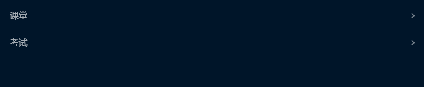

# react-demo
### 使用框架
react
创建目录 
```
create-react-app react-demo
cd react-demo
```
### 安装依赖
```
npm install
cnpm install
```
### 运行
```
npm start
```
### 打包
```
npm run build
```
点击最下方的空白页面或是右侧的放大图标

点击右侧的小箭头会显示可以浏览的内容，点击即可进入浏览

### 内容介绍
#### cinema
猫眼电影，简单渲染和模糊搜索
#### pay
业务中心 可编辑自己的应用（添加或是删除，或是查看）
#### monthA
使用递归写出一个文件目录，且可添加可删除
#### shopping 
一个购物车中出现的多选，全选，全不选功能
#### shopCar
购物页面上的商品选取颜色和大小码
#### drag 
小方块的拖拽
#### address 
收货地址